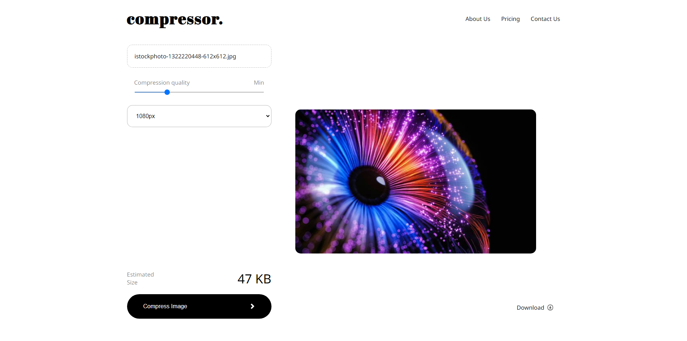

<h1 style="text-align: center">Image Compressor 📷</h1>

<p> Image Compressor online is a single page web application which uses web workers to compress the resolution and size of your image, built with react js and third party library browser-image-compression by Donaldcwl.
</p>

<a href="https://image-compressor-online.netlify.app/
">Link to website 🌐 </a> 
<br/>
or copy the link below

```
https://image-compressor-online.netlify.app/
```

# Features
- Smooth responsive ui for both desktop, tablet, and mobile devices.

- Multi-thread (web worker) non-blocking compression is supported.

- Customization options like limit the image size, change the output resolution.

- Can compress jpeg, png, webp, and bmp images by reducing resolution or storage size before uploading to the application server to save bandwidth.

# Tech Stack
- React JS
- React router dom
- Browser image compression
- Netlify (For deployment)

# Demo

<br/>
<br/>


<h3>Installation</h3>

```
npm install browser-image-compression --save
```
```
import imageCompression from 'browser-image-compression';
```

## Browsers support

| [](http://godban.github.io/browsers-support-badges/)<br/>IE / Edge | [](http://godban.github.io/browsers-support-badges/)<br/>Firefox | [](http://godban.github.io/browsers-support-badges/)<br/>Chrome | [](http://godban.github.io/browsers-support-badges/)<br/>Safari | [](http://godban.github.io/browsers-support-badges/)<br/>iOS Safari | [](http://godban.github.io/browsers-support-badges/)<br/>Opera |
| --------- | --------- | --------- | --------- | --------- | --------- |
| IE10, IE11, Edge| last 2 versions| last 2 versions| last 2 versions| last 2 versions| last 2 versions
